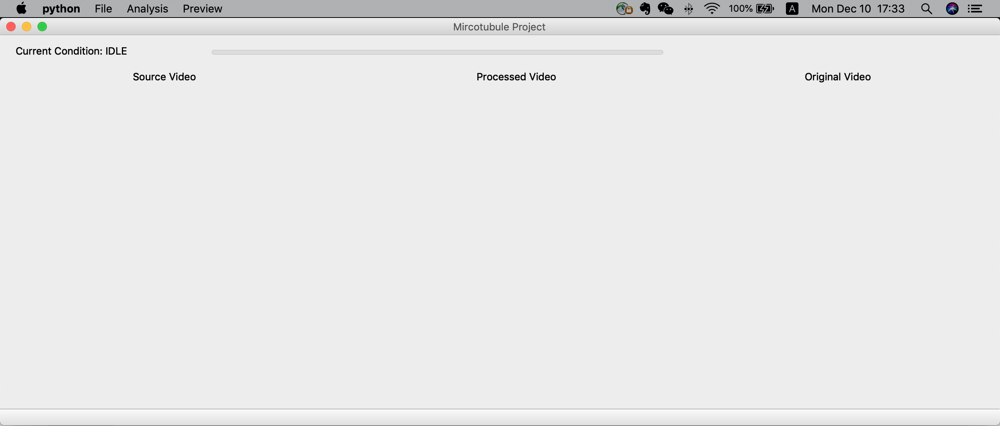
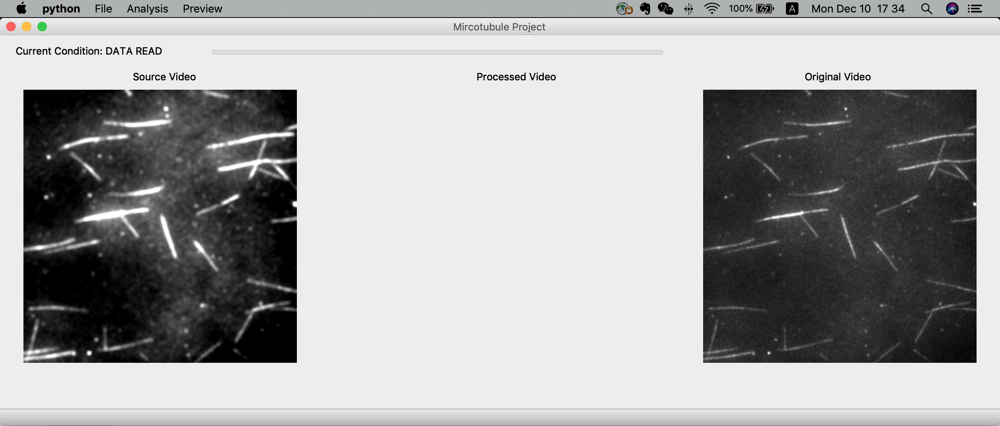
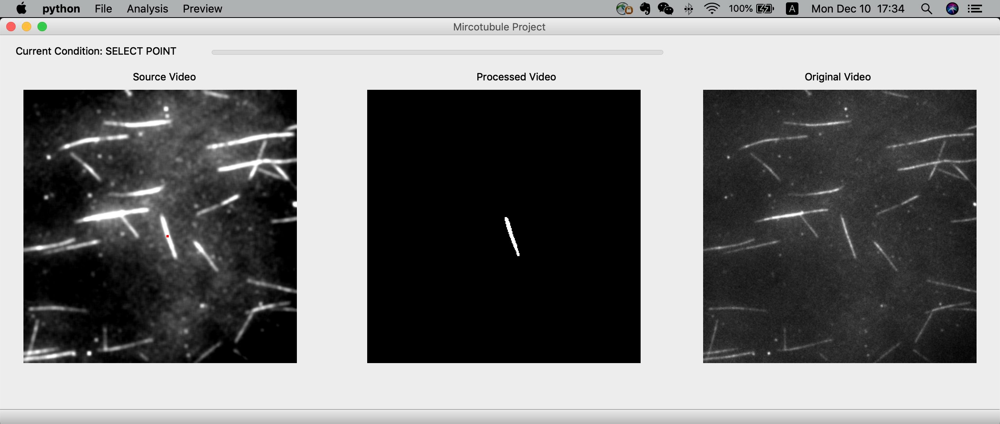
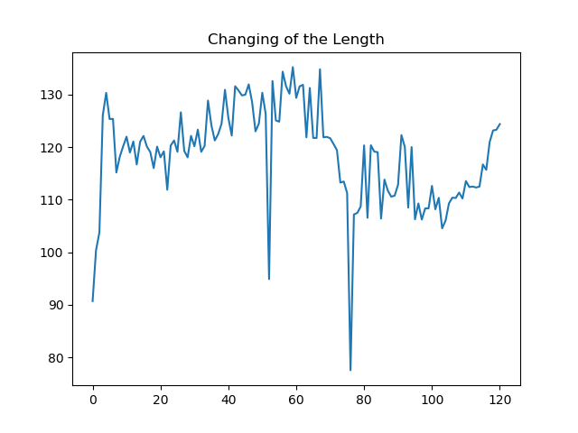

# Track-Microtubule
View demo vide https://drive.google.com/file/d/11G9OLbeq1GQM9e_PDTk29YPdt0eHBUIl/view?usp=sharing or read report in `report` folder. If you want to run it by yourself, you need to prepare test `.tiff` data.

Any Question: wjgancn@gmail.com

Following contents are extracted from report.
## Readme for Demo
Firstly, install required python library will be:
- cv2 (OpenCV)
- numpy
- PIL
- sklearn
- PyQt5

Then, run `main.py`. The GUI will run as follow.

Click `Analysis->SelectROI` in menu bar. You can choice the POI in left image in GUI as follow.

Click `Analysis->Start` in menu bar. The algorithm will run one time as follow.

Click `Preview->Play` in menu bar, the process will be finished in all video.

Finally, you can get changing of a plot about changing of length of target microtubule in root path as follow.

