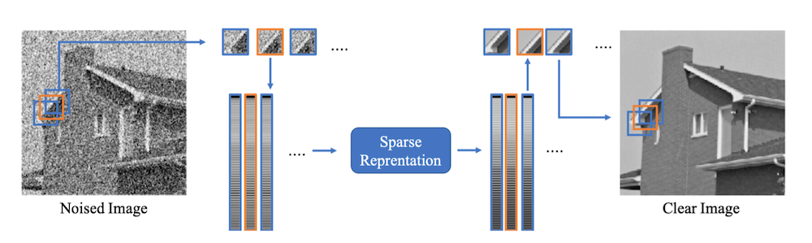

# Group-Based Sparse Representation for Image Denoising

The problem formulation is:

where in this cases, input y is a group of patches have non-local similarity within the whole image. The optimization is ADMM method.

The total flowchart is shown as:

## Experiment

