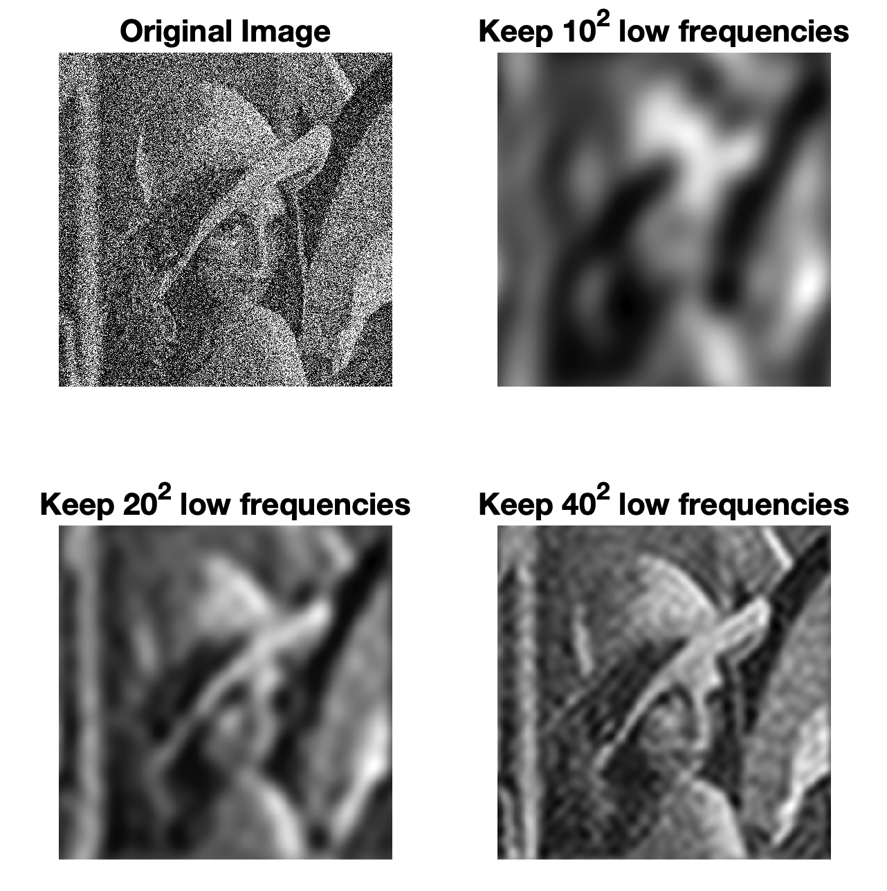
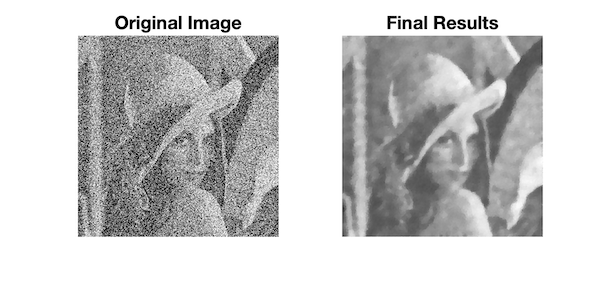
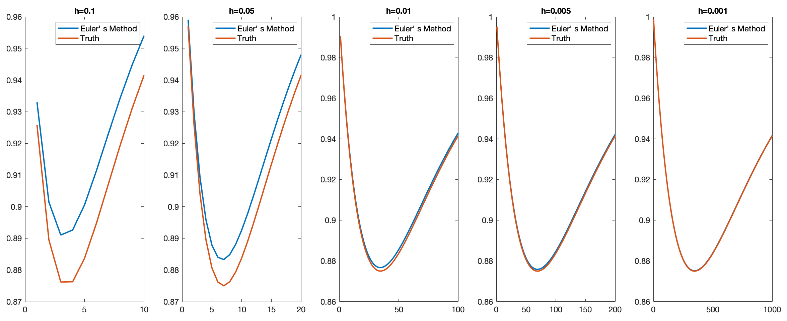
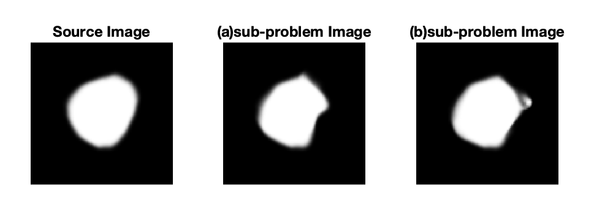

Concrete Problem Set can be seen in .PDF file in each homework folder.

# HW1

## Prob2

Low-pass filter image denosing in Frequency domain.

## Prob3

Total Variation image denosing.

# HW2

## Prob1

Implement of Euler' s Method.

## Prob2

Implement of diffeomorphic image registration by Geodesic Shooting.

