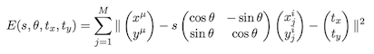
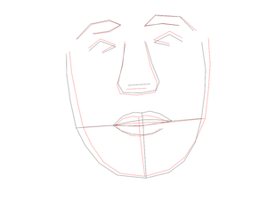

Concrete `problem and details` can be seen in `report.pdf` file in each homework folder. 

Carefully, I am not sure it's the correct solution. : )

## HW 1

### Prob 2

Low-pass filter image denosing in Frequency domain.

### Prob 3

Total Variation image denosing.

## HW 2

### Prob 1

Implement of Euler' s Method.

#### Prob 2

Implement of diffeomorphic image registration by Geodesic Shooting.
Update: Mar-20-2019 Looks like my answer is not correct. : (

## HW 3

Problem about multiple face point data.

### Prob1. (a)

Solve the optimal face data $x_u$ that can link it with all other $x_i$ with a affine transform:

In the figure, the "red face" is the first original data used to be a reference. 

### Prob1. (b)

Similar with solving eigenface. To express faces with just one the eigenvector obtained by PCA. $v_1$, $v_2$ and $v_3$ are three eigenvectors related with the three largest eigenvalues. To visualize it, to solve mean and standard derivation of all reconstructed faces and plot two faces, which are ”mean plus standard derivation” and ”mean minus standard derivation”. 

