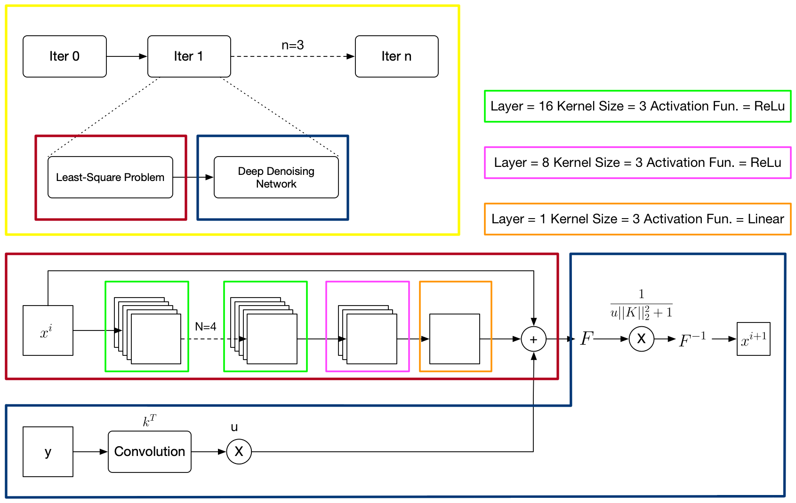
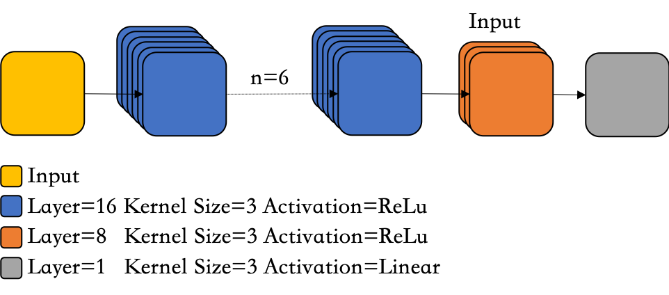
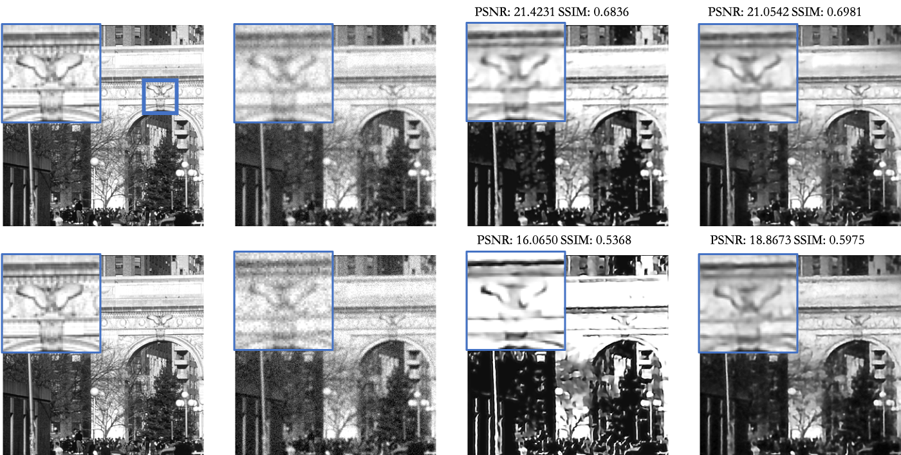

# Learning of Unrolled Optimization with Deep Priors

Two Implement in this class project: [Unrolled Optimization with Deep Priors](https://arxiv.org/abs/1705.08041) and [Learning Deep CNN Denoiser Prior for Image Restoration](https://arxiv.org/abs/1704.03264)(IRCNN). In the report, I basically describe details of unrolled method and compare it with IRCNN.

## Framework of unrolled method:

## Denoising Network in IRCNN:

## Experiment Results

From left to right: ground-truth, noise image, ircnn and unrolled method. From up to left: gaussian noise with standard deviation as 0.01(low noise) and 0.03(high noise).

## About code

Sorry, there is no direct method to use it. But my code is easy to understand. What you need to do is to review the `config.ini` file and download your favorite dataset. Good luck!
