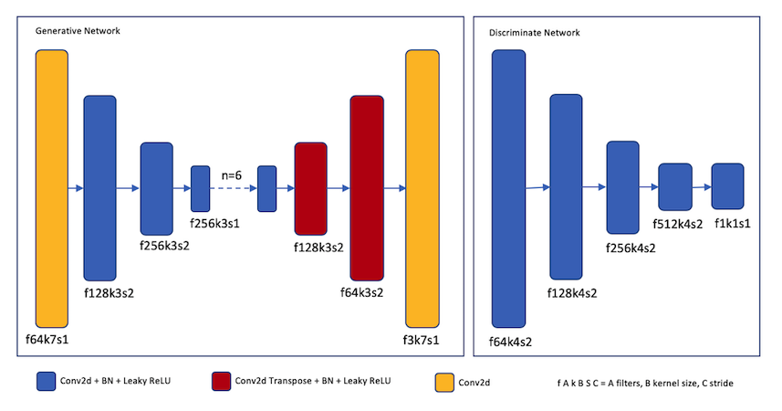

# Learning of Unpaired Image-to-Image GAN Method
A simple and easy implement of Cycle-GAN by tensorflow 1.13. 

The paper is: "Zhu, J. Y., Park, T., Isola, P., & Efros, A. A. (2017). Unpaired Image-to-Image Translation Using Cycle-Consistent Adversarial Networks"

Basic Idea of Cycle-GAN:

The image is downloaded from: [https://github.com/eriklindernoren/Keras-GAN][cycle-gan]
## Network Structure

## Experiment Result

[cycle-gan]: https://github.com/eriklindernoren/Keras-GAN